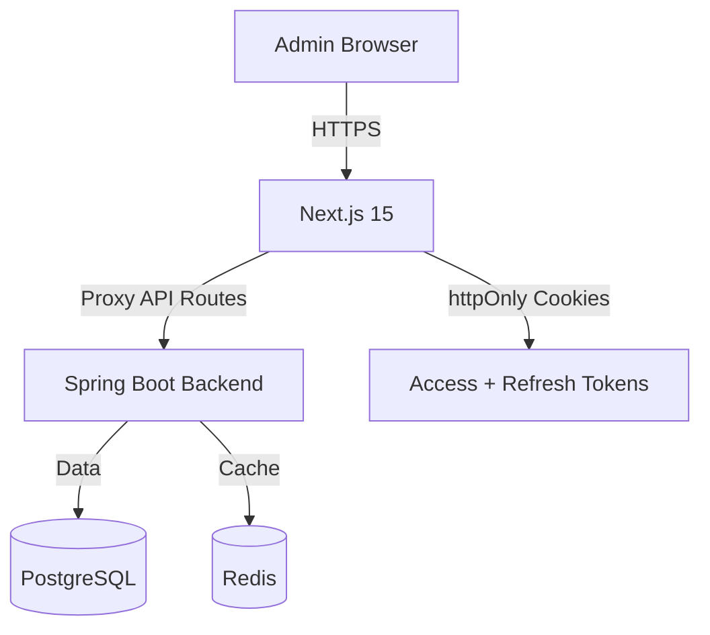
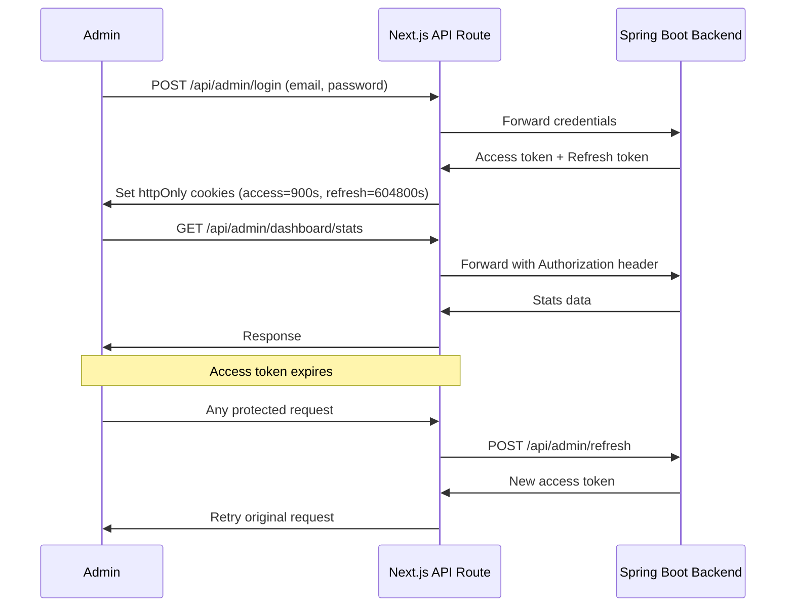
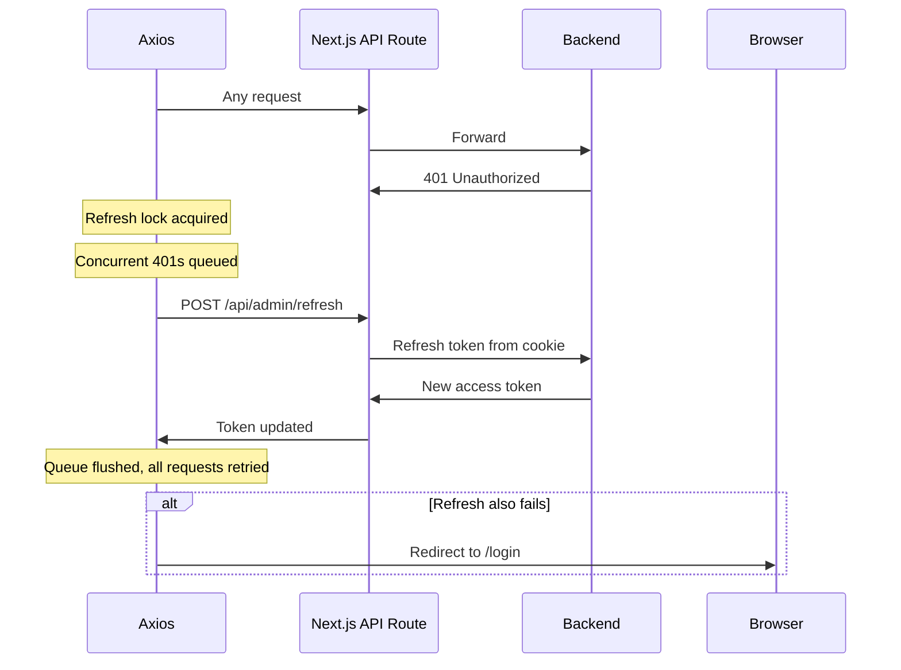
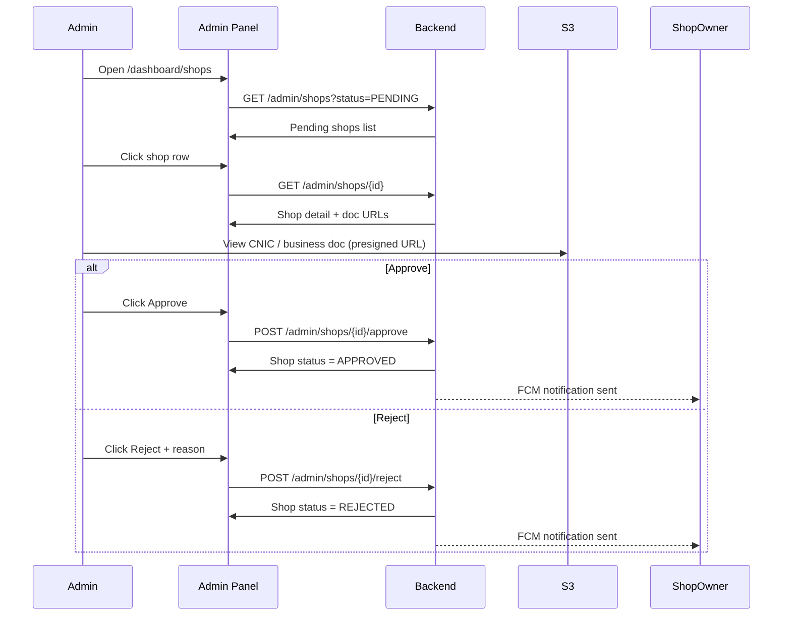
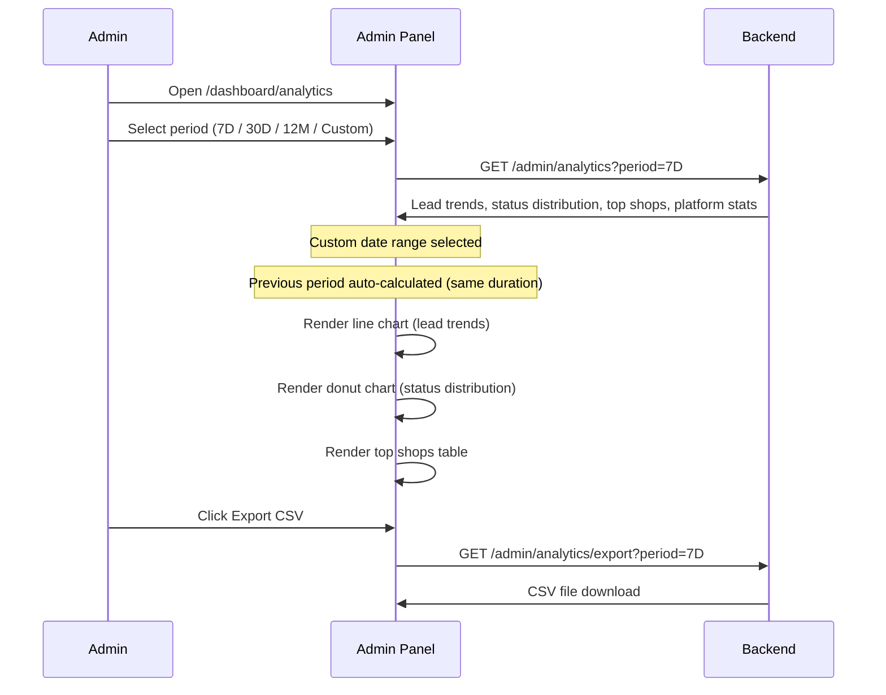

# Repairo — Admin Panel

Repairo Admin Panel is a Next.js 15 web application for platform administrators to manage users, shops, leads, payments, and analytics in one place.

---

## Tech Stack

- Next.js 15, TypeScript
- Tailwind CSS, shadcn/ui
- Axios with refresh interceptor
- Next.js API Routes as proxy layer
- httpOnly cookies for token storage
- Recharts (analytics charts)

---

## Roles

Only ADMIN role can access this panel. Authentication is handled via email + password, tokens stored in httpOnly cookies — never in localStorage.

---

## System Architecture



---

## Auth Flow



---

## Token Refresh Flow (Axios Interceptor)



---

## Shop Approval Flow



---

## Analytics Flow



---

## Prerequisites

- Node.js 18+
- Running Repairo Spring Boot backend

---

## Environment Variables

Create a `.env.local` file:

```
NEXT_PUBLIC_API_URL=http://localhost:8080
```

All API calls go through Next.js API routes — backend URL is never exposed to the browser.

---

## How to Run

```bash
npm install
npm run dev
```

Panel runs on `http://localhost:3000`

Middleware automatically protects all `/dashboard/*` routes. Unauthenticated users are redirected to `/login`.

---

## Pages Overview

**`/login`** — Admin email + password login

**`/dashboard`** — Stats cards, recent pending shops, recent activity feed

**`/dashboard/shops`** — Tabs for Pending, Approved, Rejected shops. Search, pagination, slide-over detail drawer with document viewer and approve/reject actions

**`/dashboard/leads`** — Lead list with status filter, search (Enter key), pagination, CSV export. Lead detail page with images lightbox, vehicle info, accepted quote card

**`/dashboard/users`** — Tabs for All, Car Owners, Shop Owners, Admin. User detail drawer with stats, recent activity, block/unblock actions

**`/dashboard/activity`** — Paginated activity log, filter by activity type

**`/dashboard/analytics`** — Period selector, stats cards, lead trend line chart, status distribution donut chart, top shops table, CSV export

---

## Proxy API Routes

All backend calls go through Next.js API routes. Browser never talks to Spring Boot directly.

```
POST   /api/admin/login
POST   /api/admin/refresh
GET    /api/admin/dashboard/stats
GET    /api/admin/dashboard/recent-shops
GET    /api/admin/activity/recent
GET    /api/admin/activity
GET    /api/admin/shops
GET    /api/admin/shops/counts
GET    /api/admin/shops/{id}
GET    /api/admin/users
GET    /api/admin/users/counts
GET    /api/admin/users/{id}
POST   /api/admin/users/{id}/block
POST   /api/admin/users/{id}/unblock
GET    /api/admin/leads
GET    /api/admin/leads/export
GET    /api/admin/leads/{id}
GET    /api/admin/analytics
GET    /api/admin/analytics/export
```

---

## Key Decisions

- Admin tokens stored in httpOnly cookies, not localStorage — XSS safe
- All backend calls proxied through Next.js API routes — backend URL never exposed to browser
- Axios refresh lock implemented — concurrent 401s are queued, not duplicated
- Search triggers on Enter key only — no debounce needed
- CLOSED lead status displayed as COMPLETED on frontend
- Analytics custom date range automatically calculates previous period of same duration
- Lead trend grouping is daily for ranges up to 60 days, monthly for ranges above 60 days
- Active Shops stat counts only APPROVED + is_active shops
- Monthly revenue and GMV hardcoded (payments are mocked)
- Shop rating column kept as placeholder for future module
